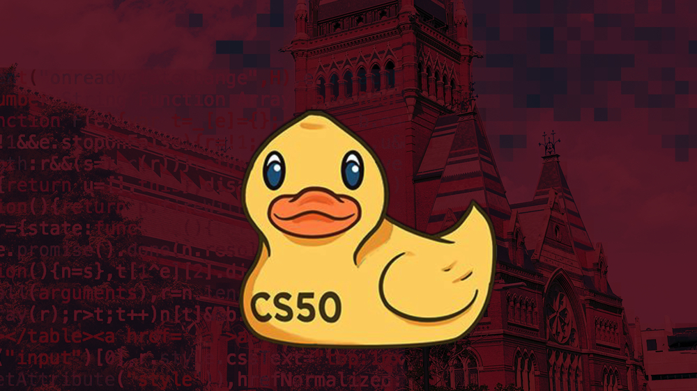

# 🐤 CS50's Introduction to Computer Science
This repository contains my notes and exercises from the [CS50's Introduction to Computer Science](https://cs50.harvard.edu/x/2024/) course.

### Features:

- ✅ **Lectures**: The lectures and notes from the course.
- ✅ **Exercises**: My solutions to the exercises from the lectures.
- ✅ **Problem Sets**: The problem sets from the course.
- ✅ **Practice**: Extra exercises to practice.
- ✅ **Final Project**: The final project from the course.
- ✅ **Resources**: Useful resources to study computer science.

## 📄 Table of Contents
- [About the Course](#-about-the-course)
- [Resources](#-resources)
- [Lectures](#-lectures)
- [Problem Sets](#-problem-sets)
- [Practice](#-practice)
- [Final Project](#final-project)
- [Contributing](#-contributing)
- [License](#-license)

## 🎓 About the Course

CS50's Introduction to Computer Science is a free online course offered by Harvard University. The course covers a wide range of topics, including algorithms, data structures, software engineering, web development, and more.

The course is available on [edX](https://www.edx.org/course/cs50s-introduction-to-computer-science) and [Harvard University](https://cs50.harvard.edu/x/2024/).

> 🐣 Enjoy learning computer science with CS50!

## 📚 Resources

You can take this course in the following platforms:

- [edX](https://www.edx.org/course/cs50s-introduction-to-computer-science)
- [Harvard University](https://cs50.harvard.edu/x/2024/)
- [YouTube - Course Playlist](https://youtube.com/playlist?list=PLhQjrBD2T381WAHyx1pq-sBfykqMBI7V4&si=QOHLPWvSKuv_n9rn)
- [Youtube - Full Course](https://youtu.be/8mAITcNt710?si=ZXAUTY5V6rR9ItRB)

Here are some useful resources to help you with the course:

- [CS50 IDE](https://ide.cs50.io/)
- [CS50 Reference](https://cs50.readthedocs.io/)
- [CS50 Manual](https://manual.cs50.io/)
- [CS50 on GitHub](https://www.github.com/cs50)

You can also follow CS50 on social media:
- [CS50 on Twitter](https://twitter.com/cs50)
- [CS50 on Facebook](https://www.facebook.com/cs50)
- [CS50 on Instagram](https://www.instagram.com/cs50/)
- [CS50 on YouTube](https://www.youtube.com/user/cs50tv)
- [CS50 on Twitch](https://www.twitch.tv/cs50tv)
- [CS50 on LinkedIn](https://www.linkedin.com/company/cs50/)
- [CS50 on Discord](https://discord.gg/cs50)

Other Editions:

- [2024](https://cs50.harvard.edu/x/2024/)
- [2023](https://cs50.harvard.edu/x/2023/)
- [2022](https://cs50.harvard.edu/x/2022/)
- [2021](https://cs50.harvard.edu/x/2021/)
- [2020](https://cs50.harvard.edu/x/2020/)
- [2019](https://cs50.harvard.edu/x/2019/)

## 📖 Lectures

Lectures are available in this repository:

- [Week 0](/lectures/week-0)
- [Week 1](/lectures/week-1)
- [Week 2](/lectures/week-2)
- [Week 3](/lectures/week-3)
- [Week 4](/lectures/week-4)
- [Week 5](/lectures/week-5)
- [Week 6](/lectures/week-6)
- [Week 7](/lectures/week-7)
- [Week 8](/lectures/week-8)
- [Week 9](/lectures/week-9)
- [Week 10](/lectures/week-10)

> You can access all the lectures [here](https://cs50.harvard.edu/x/2024/weeks/).

## 📝 Problem Sets

The following problem sets are available in this repository:

- [Problem Set 0](/problems/pset-0)
- [Problem Set 1](/problems/pset-1)
- [Problem Set 2](/problems/pset-2)
- [Problem Set 3](/problems/pset-3)
- [Problem Set 4](/problems/pset-4)
- [Problem Set 5](/problems/pset-5)
- [Problem Set 6](/problems/pset-6)
- [Problem Set 7](/problems/pset-7)
- [Problem Set 8](/problems/pset-8)
- [Problem Set 9](/problems/pset-9)

## 🏋️ Practice

The following practice exercises are available in this repository:

- [Practice 1](/practice/week-1)
- [Practice 2](/practice/week-2)
- [Practice 3](/practice/week-3)
- [Practice 4](/practice/week-4)
- [Practice 5](/practice/week-5)
- [Practice 6](/practice/week-6)
- [Practice 7](/practice/week-7)
- [Practice 8](/practice/week-8)
- [Practice 9](/practice/week-9)

> You can access all the practice exercises [here](https://cs50.harvard.edu/x/2024/practice/).

## Final Project

Coming soon...

## 💻 Contributing

If you want to contribute to this project, you can follow the steps below:

1. Fork this repository
2. Create a new branch
3. Make your changes
4. Commit your changes
5. Push your changes
6. Open a pull request

> If you have any questions, you can open an issue.

## 📜 License

This repository is licensed under the [MIT]. See the [LICENSE](LICENSE) file for details.

[Back to top](#cs50)